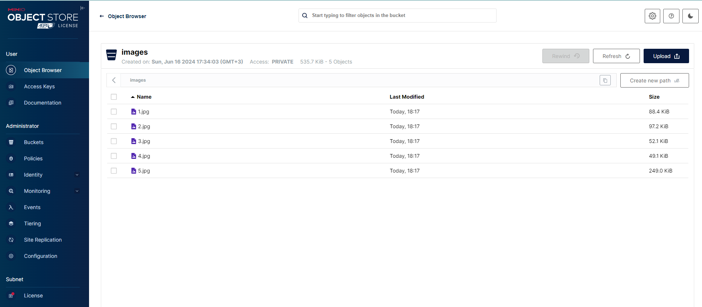

# Тестовое задание на позицию Python Developer от MADSOFT

## Задание:

Разработайте веб-приложение на Python, используя FastAPI, которое предоставляет API для работы с коллекцией мемов.
Приложение должно состоять из двух сервисов: сервис с публичным API с бизнес-логикой и сервис для работы с
медиа-файлами, используя S3-совместимое хранилище (н-р, MinIO).

## Функциональность(/memes заменена на /images):

● GET /memes: Получить список всех мемов (с пагинацией).

● GET /memes/{id}: Получить конкретный мем по его ID.

● POST /memes: Добавить новый мем (с картинкой и текстом).

● PUT /memes/{id}: Обновить существующий мем.

● DELETE /memes/{id}: Удалить мем.

## Требования:

● Используйте реляционную СУБД для хранения данных.

● Обеспечьте обработку ошибок и валидацию входных данных.

● Используйте Swagger/OpenAPI для документирования API.

● Напишите хотя бы несколько unit-тестов для проверки основной функциональности.

● Напишите Readme, из которого понятна функциональность проекта и инструкция по локальному запуску для разработки.

● Проект должен состоять минимум из: 1 сервис с публичным API, 1 сервис с приватным API для изображений,
1 сервис СУБД, 1 сервис S3-storage.

● Напишите docker-compose.yml для запуска проекта.

## Ожидаемый результат:

● Публичный git-репозиторий с проектом согласно перечисленным требованиям.

## Использование:

1. Установите все зависимости, указанные в файле requirements.txt:
```
pip install -r requirements.txt 
```
2. Запустите проект с помощью docker-compose:
```
docker-compose up -d
```
3. Откройте Swagger UI в браузере(используйте VPN, если вы на территории РФ):
```
http://localhost:8000/docs
```
4. Используйте API для работы с коллекцией мемов;
5. Используйте скрипт, который загружает все изображения из указанного каталога и генерирует CSV-файл с путями к
   изображениям и загруженными идентификаторами. Например, если вы запустили службу с помощью docker-compose,
   вы можете запустить этот скрипт с sample_images, выполнив следующую команду:
```
python upload_images.py --image_dir "sample_images" --csv_name "uploaded.csv" --csv_delimiter ";" --api_url "http://localhost:9000/images"
```
6. Загрузите все изображения из minio в sqlite3 используя файл db.py(файлы пока только загружаются через web интерфейс);
7. Следующий этап доработки использовать эту таблицу для запросов.

## Тестирование:

1. Запустите тесты с помощью команды(предварительно перейдите в директорию tests):
```
pytest
```
2. Проверьте, что все тесты пройдены.

## Документация:

1. Swagger/OpenAPI документация доступна по адресу:
```
http://localhost:8000/docs
```
2. Файл README.md содержит информацию о функциональности проекта и инструкции по локальному запуску для разработки.

## Скриншоты:





## Errors:

Проект сырой нужно дорабатывать на данный момент существует ряд ошибок:

1. Реляционная СУБД реализована в виде файла uploaded.csv;
2. Загрузка на сервер коллекции мемов с использованием скрипта: upload_images.py, работает с переменным успехом,
   minIO отказывается принимать файлы(но через web интерфейс загрузить можно и потом запросить ID);
3. Отправка post запроса через swagger, возвращает ошибку типа(загрузка возможна через терминал и создания 
временного файла(
``` 
curl -X 'POST' -H 'accept: application/json' -H 'Content-Type: multipart/form-data' --data-binary "C:\Users\Roman\Desktop\3.jpg" -o "C:\Windows\Temp\uploa
ded_file" 'http://localhost:8000/images/'
```
)

```
curl -X 'POST' \
  'http://localhost:8000/images/' \
  -H 'accept: application/json' \
  -H 'Content-Type: multipart/form-data' \
  -F 'file=@C:/Users/Roman/Desktop/1.jpg;type=image/jpeg'
```
```
Error: Unprocessable Entity

Response body
Download
{
  "detail": [
    {
      "type": "value_error",
      "loc": [
        "body",
        "file"
      ],
      "msg": "Value error, Expected UploadFile, received: <class 'str'>",
      "input": "@C:/Users/Roman/Desktop/1.jpg;type=image/jpeg",
      "ctx": {
        "error": {}
      }
    }
  ]
}
```

